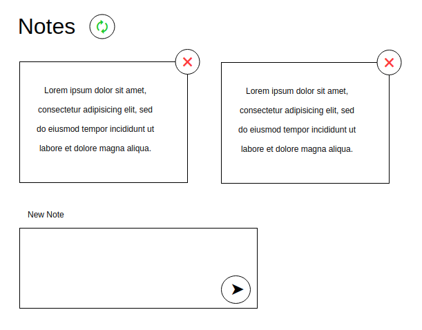

[CRUD](https://wee-owl.github.io/ra-http-crud/)
===
[](https://ci.appveyor.com/project/wee-owl/ra-http-crud)

Необходимо реализовать базовый CRUD без обновления при работе с HTTP.



## Общая механика

Первоначальная загрузка: делается http-запрос GET на адрес http://localhost:7070/notes, полученные данные отображаются в виде карточек с возможностью удаления.

Добавление:
1. Вы заполняете форму и нажимаете кнопку «Добавить».
2. Выполняется http-запрос POST на адрес http://localhost:7070/notes, в теле запроса передаётся следующий JSON:
```json
{
    "id": 0,
    "content": "То, что было введено в поле ввода"
}
```
3. После чего делается запрос на получение всех записей и происходит обновление списка — GET http://localhost:7070/notes.

Удаление:
1. Вы нажимаете на крестик на одной из карточек.
2. Выполняется http-запрос DELETE на адрес http://localhost:7070/notes/{id}, где id — это идентификатор заметки.
3. После чего делается запрос на получение всех записей и происходит обновление списка — GET http://localhost:7070/notes.

Обновление:
1. Вы нажимаете на кнопку «Обновить» — две зелёные стрелочки.
2. После чего делается запрос на получение всех записей и происходит обновление списка — GET http://localhost:7070/notes.
